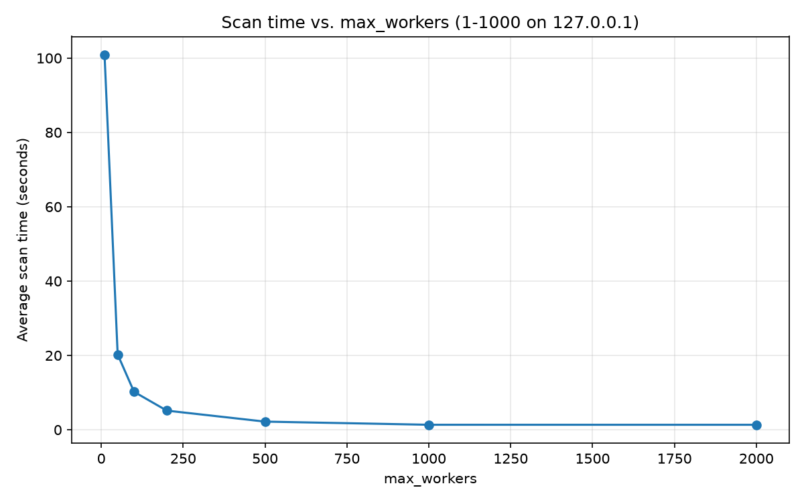

# Python Port Scanner
A simple project I made to learn about sockets and multithreading. It's a multithreaded, configurable TCP port scanner written completely in python. 
When given a target IP address and a port range, it attempts to connect to each port and reports which ones are open, optionally returning a service banner as well.


## Features
- Concurrent scanning using a thread pool for faster results.
- IP address validation
- Basic banner grabbing on open ports 
- Elapsed time reporting for scans
- Configurable settings

## Requirements
- Python 3.8+

## Installation
```bash
git clone https://github.com/BenP64/PortScanner
cd PortScanner
```

## Usage
Run the script directly:
```bash
python PortScanner.py
```
When first ran, a 'settings.ini' file is created with the default values for 'max_workers' and 'port_timeout'.

You'll see a main menu prompt:
```
----- Scanner -----
[1] Port Scanner
[2] Settings
[3] Exit
```
### Port scanner
Selecting '1' will prompt you for a target IP and port range:
```
Target IP: 192.168.1.1
Port range: 20-100
```

**Target ip** - A valid IPv4 or IPv6 address.

**Port range** - Two integers separated by a hyphen, e.g. "20-100".
Both values must be between "0" and "65535", and start port cannot be larger than the end port.

#### Example output
```
Target ip: 192.168.1.1
Port range: 20-100
Starting scan on 192.168.1.1 from port 20 to port 100...
Port 22 is Open: SSH-2.0-OpenSSH_8.9
Port 80 is open.
 
Scan complete! 2 open port(s) found in: 0:00:01.243
```

### Settings
Selecting '2' opens the settings menu:
```
----- SETTINGS -----
[1] Adjust max_workers
[2] Adjust port_timeout
[3] Revert to default settings
[4] Back
```

- **Adjust max_workers** - sets how many ports are scanned concurrently.
Higher values usually scan faster (see [Performance](#performance)), however very high values may hit your OS's open file limit. 
- **Adjust port_timeout** - sets how long (in seconds) to wait for a response before marking a port as closed/filtered.
- **Revert to default settings** - resets 'settings.ini' to its original values.

## Specifications
| Item                 | Detail                                                          | 
|----------------------|-----------------------------------------------------------------|
| Language             | Python 3                                                        |
| Concurrency model    | `ThreadPoolExecutor`, default `max_workers=200`                 |
| Connection timeout   | default, 1 second per port                                      |
| Banner read          | Up to 1024 bytes, best effort (skipped silently if unavailable) |
| Supported IP formats | IPv4 and IPv6 (validated via `ipaddress` module)                |
| Port range           | 0–65535                                                         |
| Output               | Printed to stdout in real time as results complete              |

## Performance
'max_workers' controls how many ports are scanned concurrently. Since scanning is I/O-bound, increasing this value can greatly reduce the scan time. 

To measure this, I ran 3 trials at each value (10, 50, 100, 200, 500, 1000, 2000) for 'max_workers', then averaged the results and plotted them using Matplotlib in a separate script.

| max_workers | Average scan time (seconds) | 
|-------------|-----------------------------|
| 10          | 100.835                     |
| 50          | 20.257                      |
| 100         | 10.209                      |
| 200         | 5.150                       |
| 500         | 2.192                       |
| 1000        | 1.345                       |
| 2000        | 1.341                       |



## How it works
1. **`validate_ip`** — checks the target IP is well-formed using Python's `ipaddress` module.
2. **`parse_port_range`** — parses the `start-end` input into two integers and checks they fall within valid bounds.
3. **`scan_port`** — attempts a TCP connection to a single port; if successful, tries to read a short banner.
4. **`scan`** — dispatches a `scan_port` call for every port in the range across a thread pool, printing results as they arrive.
5. **`port_scanner`** — the entry point that collects user input and ties the above together.


## Limitations
- Only supports TCP connect scans (no UDP or SYN scanning)
- No command-line flags — all input is via interactive prompts
- No logging to file; output is console-only